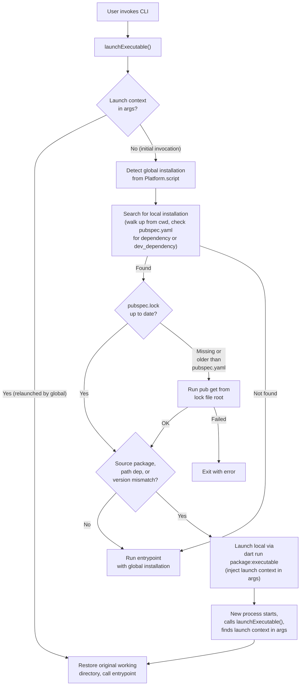

CLI development utility to support launching locally installed versions.

When the globally installed version of a CLI is launched and it finds a locally
installed version of itself that is a different version, it will launch the
locally installed version.

Otherwise, the globally installed version will continue to run.

Installing means adding the package that contains the CLI executable to a
pubspec.yaml file.

To find the locally installed version, the globally installed version will
search for a pubspec.yaml file in the current directory or any parent directory.
If it finds one, it will look for a dependency on the package that contains the
CLI executable.

In addition, if the CLI is executed in the package that contains the CLI
executable, the current version in that package will be launched. This is useful
for development.

## Launch flow

