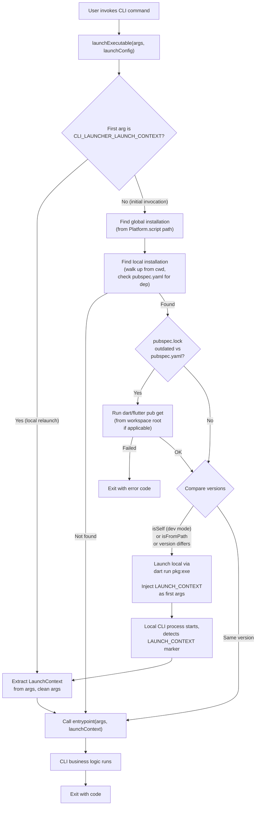

```mermaid
flowchart TD
    A["User invokes CLI command"] --> B["launchExecutable(args, launchConfig)"]
    B --> C{"First arg is\nCLI_LAUNCHER_LAUNCH_CONTEXT?"}

    C -- "Yes (local relaunch)" --> D["Extract LaunchContext\nfrom args, clean args"]
    C -- "No (initial invocation)" --> E["Find global installation\n(from Platform.script path)"]

    E --> F["Find local installation\n(walk up from cwd,\ncheck pubspec.yaml for dep)"]

    F -- "Not found" --> GLOBAL["Call entrypoint(args, launchContext)"]
    F -- "Found" --> G{"pubspec.lock\noutdated vs\npubspec.yaml?"}

    G -- "Yes" --> H["Run dart/flutter pub get\n(from workspace root\nif applicable)"]
    G -- "No" --> I

    H -- "Failed" --> EXIT["Exit with error code"]
    H -- "OK" --> I{"Compare versions"}

    I -- "isSelf (dev mode)\nor isFromPath\nor version differs" --> J["Launch local via\ndart run pkg:exe\n\nInject LAUNCH_CONTEXT\nas first args"]
    I -- "Same version" --> GLOBAL

    J --> K["Local CLI process starts,\ndetects LAUNCH_CONTEXT marker"]
    K --> D

    D --> GLOBAL

    GLOBAL --> L["CLI business logic runs"]
    L --> M["Exit with code"]
```
